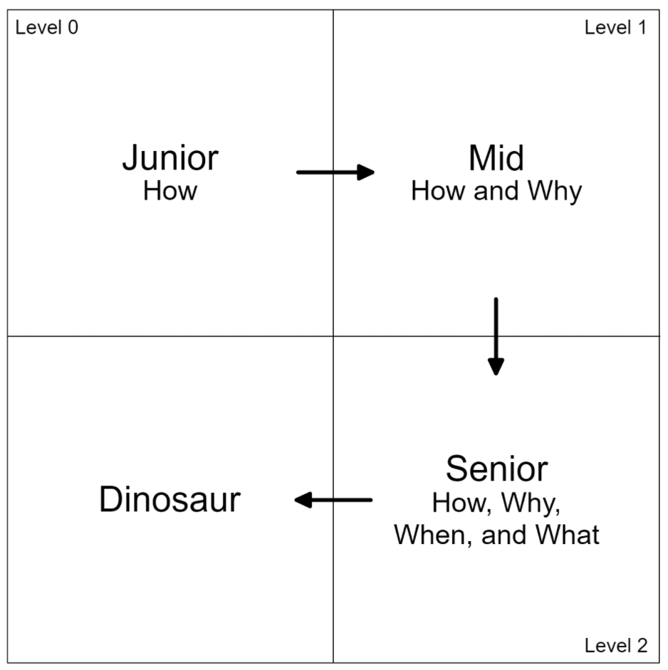
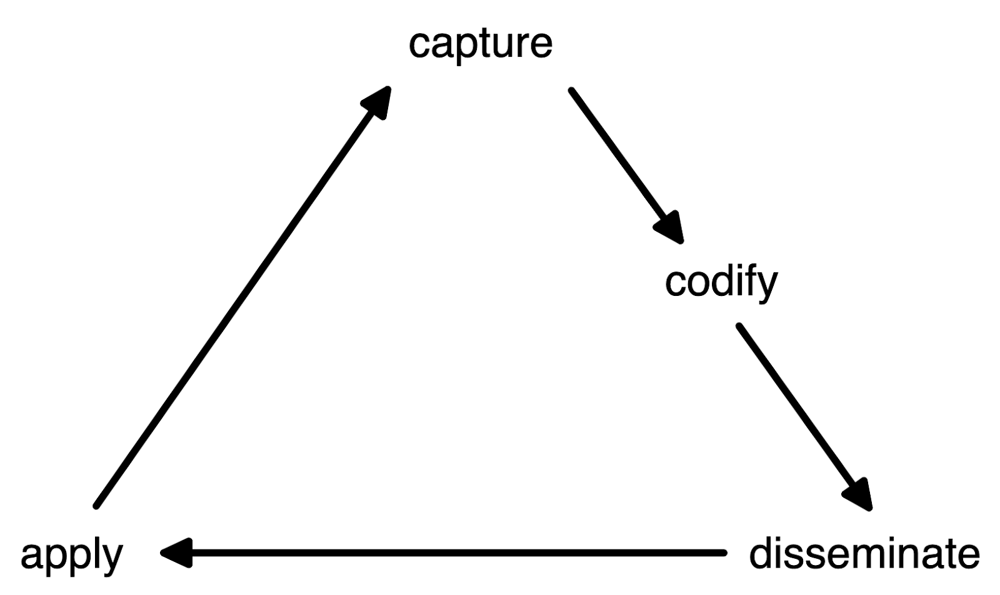
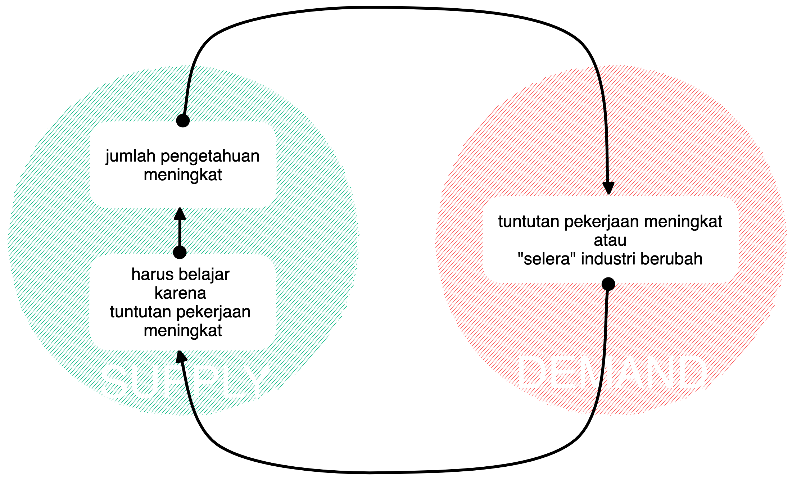

title:: Knowledge Management - How to Stay Relevant

- **WHAT** [v2.2](https://docs.google.com/presentation/d/1KQMTjyry3XsFPcUzwrafeUeM_Rrpg0NDggXR9ESd45o/edit?usp=sharing)
- **WHO** Leonardo Situmorang leonardo.situmorang@gmail.com
- **WHEN** Google Meet, January 2022
- **FLOW**
  collapsed:: true
	- di awal ingatkan agar tidak perlu membuat catatan. yang paling penting adalah mendengarkan dan bertanya jika perlu
	- di awal kasih lihat graph di Logseq yang menampilkan keterkaitan antara satu informasi dengan lainnya, *mungkin* bisa memantik rasa penasaran dan ingin tahu audiens
		- tapi harus faktorkan fokus audiens malah melenceng; malah ngoprek Logseq
	- di akhir presentasi berikan akses ke repository yang di dalamnya terdapat catatan ini, dan slide notes, yang langsung bisa di-clone oleh audiens
		- mungkin sekalian demo
	- https://github.com/aldoreno/knowledge-management/blob/main/pages/Knowledge%20Management%20-%20How%20to%20Stay%20Relevant.md
	- [Feedback Form](https://forms.gle/Bqi4DbQgoUz1QYJQ6)
- **SLIDE NOTES**
	- **Chapter #1** **End Goal: Knowledge Worker**
	  collapsed:: true
		- kita mulai dari kondisi akhir yang diharapkan: menjadi Knowledge Worker atau ^^pekerja berpengetahuan yang adaptif terhadap perubahan^^
		- **WHAT**: Knowledge worker itu umumnya memiliki 4 karakter berikut
			- perpetual learner atau ^^individu yang terus belajar^^
			- teachable artinya ^^individu yang dapat diajari^^
				- ini hasil refleksi ke diri saya sendiri sebagai individu yang ego-nya agak besar
				- ^^semakin besar ego, semakin sulit diajari^^, karena merasa lebih benar (atau lebih baik) dari orang lain; kurang humble
			- teacher or mentor artinya ^^individu yang dapat mengajari^^
				- dapat diajari dan mengajari
			- hacker
				- atau dalam Bahasa Indonesia kita bisa sederhanakan menjadi ^^*tukang ngoprek*^^
				- atau tukang *ngulik*
				- pada dasarnya memiliki ^^rasa penasaran sangat besar untuk belajar^^
			- karakter ini lah yang dapat membuat kita lebih adaptif terhadap perubahan
		- **HOW**: Caranya bagaimana?
			- kita pahami dulu apa itu pengetahuan
			- cara mengelolanya
				- ^^sharing session ini akan berkutat di sini nih^^
			- membagikan pengetahuan kita ke sekeliling, dan
			- mengaplikasikan pengetahuan tersebut
			- tapi supaya apa sih ini, supaya apa sih sampai harus adaptif, kok kayaknya ribet banget begini?
		- **WHY**: Karena kita harus tetap relevan
			- dan untuk bisa tetap relevan, kita harus adaptif dengan perubahan lingkungan (misalnya: perubahan teknologi yang harus digunakan)
			- perhatikan urutannya: tetap belajar > adaptif > tetap relevan
			- OPTIONAL: tambahan catatan sedikit soal adaptif
				- orang yang tidak adaptif cenderung resistan terhadap perubahan
				- kasus: sebagai orang yang baru bergabung di organisasi dan memiliki ide untuk memperbaiki (mengubah) beberapa hal yang kurang efektif. meski niat dan prosesnya sudah benar, umumnya tetap akan mendapat penolakan dari beberapa orang (dan paling apes dari mayoritas orang di organisasi)
			- let me explain, mari kita lihat diagram
		- Diagram lifecycle of a worker
			- diagram
				- 
			- Level 0 is where majority of us all started
				- Then, we barely know *how* to do stuff
				- We require directions
				- At this level, I’d say most of our time were spent figuring out *how* to build something while neglecting the whys
			- Level 1 is when you had experiences on building things
				- At this point you know *how* to, say, build notable fully functional parts of an app
				- And begin to wonder or realize *why* things are designed or works the way they are
			- Level 2 is when you know how to build things and understands *why*
				- At this point you made better judgements of *how* things should be built, and *why*
				- And most importantly you know *what* else should (or should *not*) be built according to the needs of the organization, and *when* to (or *not* to) execute it
					- notice that at this point you are expected to have certain degree of awareness of the organization you are in
				- You start noticing what else could be improved and what could possibly make the differences (impact)
			- Dinosaur is when you no longer expands your horizon
				- You stopped being hungry
				- And you resist change.
			- bridge: nah, tadi sudah kita tetap relevan makanya butuh Knowledge Management
	- **Chapter #2** **Knowledge Management**
		- kita mulai dari memahami apa itu pengetahuan
		- **WHAT**: **Knowledge**
		  collapsed:: true
			- knowledge atau pengetahuan adalah fakta, informasi, atau kemampuan, yang kita peroleh baik dari proses edukasi (ajar-mengajar) maupun melakukan sesuatu secara langsung
			- biasanya di kelas Knowledge Management dijelaskan juga apa itu data, informasi, knowledge (pengetahuan), dan wisdom (kebijaksanaan)
				- data adalah fakta, misalnya: 185
				- informasi adalah data disertai metadata (penjelasan), misalnya: tinggi dalam centimeter
				- knowledge mencakup data dan informasi
				- wisdom ... tidak memiliki definisi baku:
					- ^^*“knowledge achieved if we are serious to expose our brain to many paradigms, to lots perspectives" (and usually only over long period of time)*^^ Source: [Biodiversity: Indonesia's "Infinity Stone" - Sharlini Eriza Putri | Endgame S2E06](https://youtu.be/KX81rmSiWy8?t=3704) (highly recommended to watch 🔥🔥🔥)
					- ^^wisdom includes realising something you dont know because you realise there may be paradigms you have no knowledge of^^. [Source](https://www.youtube.com/watch?v=obqedyeUcwk)
			- OPTIONAL: dari definisi di atas jadi ada dua tipe pengetahuan. [Source](https://medium.com/@amandaposthuma/theoretical-vs-practical-knowledge-86cab1113abd)
				- **practical knowledge**
					- knowledge acquired by day-to-day hands-on experiences. In other words, practical knowledge is gained through doing things; it is very much based on real-life endeavors and tasks.
					- for example: learning how to ride a bike. you can’t learn how to ride a bike simply by reading a book.
					- atau pengetahuan di mana otak dapat memberi sinyal ke perangkat motorik (terkait muscle memory)
				- **theoritical knowledge**
					- teaches the reasoning, techniques and theory of knowledge
		- BRIDGE: lalu kenapa pengetahuan harus dikelola?
		- **WHY**: ^^because knowledge, like financial asset, could builds up like compound interest^^
		  collapsed:: true
			- revisi slide:
				- ^^Knowledge, like financial asset, could builds up like compound interest^^
			- karena pengetahuan mirip dengan aset finansial: dapat bertumpuk seperti compound interest
			- additional notes:
				- ^^compounding is the ability of an asset to generate earnings, which are then reinvested in order to generate their own earnings.^^
			- OPTIONAL reading materials:
				- Knowledge Begets Knowledge https://janav.files.wordpress.com/2016/09/knowledgebegetsknowledge.pdf
				- https://fs.blog/compounding-knowledge/
				- https://medium.com/personal-growth/compound-learning-the-most-powerful-tool-for-acquiring-skills-faster-123e14f9f9d9
		- BRIDGE: nah karena pengetahuan mirip financial asset, kita bahas dulu dua tipe aset --eh, pengetahuan-- yang penting untuk kita ketahui
		- **Tacit Knowledge**
			- TODO cari atau buat gambar otak untuk merepresentasikan bahwa pengetahuan ini berada _di dalam_ kepala/otak masing-masing
			- pengetahuan yang ada di dalam kepala
			- sangat bernilai karena bahan utama keunggulan kompetitif (competitive advantage) seorang individu
			- namun sulit untuk dikodifikasi (apa itu kodifikasi akan dijelaskan setelah ini), meski bisa dilatih
			- karena pengetahuan ini ada di kepala (otak) maka ^^tacit knowledge sangat dipengaruhi kemampuan kognitif (cognitive skills) tiap individu^^
			- apa itu **cognitive skills**? #card
				- sederhananya: daya pikir
				- cognitive skills adalah kemampuan otak untuk (termasuk tapi tidak terbatas):
					- menyimpan informasi
					- mengambil kembali informasi
					- memproses informasi untuk mencapai kesimpulan / reasoning: memahami atau menjelaskan, yang mencakup:
						- menghubungkan informasi (connecting the dots) yang sudah tersimpan, dan
						- melakukan kalkulasi
					- holds attention
				- reading materials:
					- Cognitive skills are brain-based skills which are needed in acquisition of knowledge, manipulation of information and reasoning. Source: [Wikipedia](https://en.wikipedia.org/wiki/Cognitive_skill).
					- Cognitive skills, or cognitive abilities, are the ways that your brain remembers, reasons, holds attention, solves problems, thinks, reads and learns. Source: [Indeed.com](https://www.indeed.com/career-advice/career-development/cognitive-skills-how-to-improve-them)
					- Cognitive skills are the core skills your brain uses to think, read, learn, remember, reason, and pay attention. Source: [LearningRX](https://www.learningrx.com/what-is-brain-training-/what-are-cognitive-skills-/).
			- BRIDGE: setelah tahu soal cognitive skills aku jadi menyadari daya pikir dan batasan diri sendiri
				- solusinya menggunakan Knowledge Management Tools
			- BRIDGE: tacit knowledge ini lah origin dari istilah: (pindah slide)
		- **(Tacit) Knowledge is power. See politics in the workplace**
		  collapsed:: true
			- kalau pengetahuan adalah aset, maka akumulasi aset menjadi power
			- dan power condong ke arah berpolitik, contohnya lihat saja di lingkungan kantor
				- umumnya menjadi tidak bisa atau sulit digantikan meski sudah semena-mena
				- sulit digantikan karena ketika mereka meninggalkan organisasi mereka membawa pergi pengetahuan yang begitu banyak
				- ini sudah masuk ke ranah organisasi sebenernya, tapi informasi tambahan saja
		- BRIDGE: karena politik di kantor tersebut lah salah satu alasannya kenapa butuh Explicit Knowledge
		- **Explicit Knowledge**
		  collapsed:: true
			- alias Codified Knowledge, Materialized Knowledge
			- **WHAT**
				- pengetahuan yang sudah melalui proses kodifikasi sehingga dapat diakses oleh orang lain; it can be written down, transmitted, and understood by a recipient.
				- kodifikasi merujuk kepada proses mengubah pengetahuan kepala menjadi berwujud tulisan, audio, visual, atau kombinasinya, yang memiliki struktur
				- `codify(TacitKnowledge) => ExplicitKnowledge`
				- contoh: dokumentasi, buku, report, podcast, video youtube
			- **WHY**
				- dalam konteks individu, akan dibahas di belakang di Knowledge Management Cycle
				- dalam konteks organisasi, mengharuskan konversi Tacit Knowledge menjadi Explicit Knowledge:
					- mencegah / mengurangi orang berpolitik
					- mengurangi potensi Single Point of Failure (SPoF) atau [[Bus Factor]]
			- OPTIONAL:
				- project open source juga Explicit Knowledge
					- karena pada dasarnya kode program adalah pengetahuan yang bersumber dari dalam kepala yang dikodifikasi
					- namun hanya sampai pada titik tertentu
					- karena memiliki akses ke source code belum tentu dapat memahami
					- karena tahu != paham; ini butuh waktu dan energi yg banyak
				- proyek open source yang bersumber dari Google, misalnya, bisa kita maknai sebagai Explicit Knowledge yang dengan strategis ditumpahkan ke komunitas atau disebut jg spilled knowledge atau spilled innovation
					- spillovers = intellectual property yang dapat diobservasi rivals atau sengaja tersedia / terbuka. Sumber: [Strategic Decisions for Becoming a Multi-Sided Platform: A Case Study](https://aaltodoc.aalto.fi/bitstream/handle/123456789/29026/master_Korjus_Christine_2017.pdf)
				- dari situ kita bisa tebak bahwa pengetahuan yang dibagikan itu hanya sekian persen dari Tacit Knowledge yang dimiliki Google (sekarang Alphabet) dan dilakukan secara strategis
				- misalnya rilis paper tentang Big Data: [Bigtable: A Distributed Storage System for Structured Data](https://static.googleusercontent.com/media/research.google.com/en//archive/bigtable-osdi06.pdf)
					- menginspirasi riset dan implementasi yang akhirnya materialised dalam bentuk open source software
					- dihost di infrastruktur Google
					- digunakan digital start-ups untuk improve bisnis
					- digital start ups meningkat = + Alphabet customers
					- customers-nya digital start ups meningkat = + Alphabet customers
					- memajukan inovasi dan industri
				- ^^ingat: dilakukan secara strategis untuk mempertahankan competitive advantage^^ karena di-spill beberapa tahun setelah stabil mereka gunakan
			- reading materials:
				- Explicit Knowledge juga mandatory untuk membangun Low Context Cultures: https://www.culture-at-work.com/highlow.html
		- BRIDGE: setelah kita ketahui dua jenis aset (atau pengetahuan) tadi, sekarang kita pelajari gimana caranya supaya pengetahuan tersebut compounding. reminder:
			- ^^compounding is the ability of an asset to generate earnings, which are then reinvested in order to generate their own earnings.^^
	- **Chapter #3 Knowledge Management Cycle**
	  collapsed:: true
		- bertujuan agar pengetahuan kita bertumpuk juga memastikan pengetahuan tersimpan di long-term memory (penyimpanan jangka panjang)
		- Knowledge Management Cycle diagram
		  collapsed:: true
			- 
		- **END GOAL** retensi pengetahuan
		- **END GOAL** positive feedback loop
			- DONE bikin positive feedback loop yang dialami programmer berikut:
				- {:height 381, :width 617}
			- 1. supply: harus belajar karena tuntutan pekerjaan meningkat
			  2. supply: jumlah pengetahuan meningkat
			  3. demand: tuntutan pekerjaan atau industri meningkat (semakin sulit)
			  4. repeat
		- hipotesa: bisa di mulai dari tahapan yang mana pun. khususnya untuk orang yang sudah punya pengetahuan.
		- **Capture**
			- mencakup proses identifikasi apa yang perlu dipelajari
				- kalau dalam konteks pekerjaan, ^^cara ku pribadi: membuat list dari hal-hal yang kusadari betul tidak tahu^^
					- inspirasi dari [[Rumsfeldian Personal Growth Matrix]]
						- known known = menyadari kalau tahu
						- known unknown = menyadari kalau tidak tahu
						- unknown known = tidak menyadari kalau sebenernya tahu
						- unknown uknown = tidak menyadari bahwasanya tidak tahu
				- kalau dalam konteks sehari-hari, karena menyadari keterbatasan daya pikir, maka aku berusaha selalu belajar dari yang lebih tahu, lebih pintar, lebih punya daya pikir
					- salah satunya dari Twitter
					- jadi belajar untuk tidak membuat keputusan serampangan
			- dalam proses *knowledge capturing* ini mungkin identifikasi juga hal-hal yang tidak perlu (atau belum perlu) dipelajari
			- berangkat dari kebutuhan personal/organisasi
			- *menangkap* pengetahuan tersebut dari sumbernya:
				- untuk **theoritical knowledge**
					- bisa dari explicit knowledge: buku, audio, visual
					- bisa juga dari tacit knowledge: diajari ahli (expert)
					- eksperimen atau ngoprek sendiri
				- untuk **practical knowledge** :
					- dari tacit knowledge: diajari ahli (expert)
					- eksperimen, latihan. atau ngoprek sendiri
		- **Codify**
			- **WHAT** setelah kita capture sebaiknya pengetahuan yang ada dalam kepala tersebut (tacit) kita kodifikasi (explicit) agar dapat dipergunakan / diakses kembali oleh siapapun (siapapun = biasanya kita sendiri di masa depan)
			- **WHY**
				- karena berbeda dengan ngomong, ^^menulis melatih kita untuk lebih runut (terstruktur) dalam mengeluarkan isi kepala (tacit knowledge)^^
				- untuk orang dengan daya pikir (cognitive skills) kurang bagus, khususnya daya ingatnya, pembuatan catatan ini sifatnya mandatory. di sini peranan Knowledge Management Tools, akan dijelaskan di belakang
			- OPINI: proses kodifikasi ini adalah *caching* dan hasilnya adalah *cached item*
		- BRIDGE: setelah kita dapatkan pengetahuannya dan kita buat catatannya, sebisa mungkin kita bagikan pengetahuan tersebut ke lingkungan kita
		- **Disseminate**
			- **WHY**:
				- karena hal ini akan memaksa kita untuk memahami betul hal yang kita pelajari
				- karena pada prosesnya kita tetap harus belajar lagi sebelum berbagi
				- karena kita perlu memastikan legitimasi hal yang akan kita bagikan
				- memastikan kita tahu persis apa yang kita bicarakan
				- mendapatkan feedback yang membantu identifikasi ^^hal-hal yang belum kita ketahui/pahami^^
				- menginspirasi lingkungan
		- **Application**
			- **WHY**:
				- karena mubazir menjalankan cycle-nya untuk mempelajari sesuatu tapi tidak diaplikasikan
				- well, sebenarnya ga ada yang sia-sia karena pengetahuan tersebut sudah sempat tercatat di otak hanya saja mudah terlupakan (low retention) kecuali Anda punya daya ingat fotografis
		- OPINI: ^^untuk orang dengan daya pikir (cognitive skills) yang sangat bagus, kodifikasi dan diseminasi ini seperti tidak diperlukan atau hanya sekadarnya, karena mereka dapat mengandalkan daya pikirnya saja^^
	- **Chapter #4 Mental Model**
	  collapsed:: true
		- BRIDGE: sebelum pindah slide, tanya siapa yang bisa menjelaskan cara kerja layar sentuh sebelum pindah slide
		- KLARIFIKASI: ini tidak diajarkan di kelas Knowledge Management
		- KLARIFIKASI: ini adalah justifikasi saya sendiri 🤣; semua yang saya bagikan kali ini adalah perkiraan yang saya buat soal Knowledge dan Knowledge Management
		- **WHAT**
		  collapsed:: true
			- mental model adalah perkiraan yang kita buat di dalam pikiran mengenai sebuah subyek; misalnya cara kerjanya
				- perkiraan yang kita buat berdasarkan seberapa akurat pemahaman kita akan subyek tersebut
					- di mana akurasi pemahaman tergantung banyak pengetahuan kita terhadap subyek tersebut (dan subyek lain di sekitarnya)
						- diagramnya, bottom-up: `pengetahuan -> pemahaman -> perkiraan`
							- ingat: tahu != paham
						- TODO bikin segitiga pengetahuan x pemahaman x perkiraan
		- **HOW** bagaimana cara meningkatkan akurasi pemahaman?
		  collapsed:: true
			- lakukan sebanyak mungkin Knowledge Management Cycle (baca: belajar)
			- semakin banyak Knowledge Management Cycle yang kamu jalani terhadap sebuah subyek maka semakin akurat pemahaman yang kamu miliki tentang sebuah sistem
		- **WHY**
		  collapsed:: true
			- pengetahuan yang banyak akan menghasilkan pemahaman yg semakin akurat
			- hipotesa: ^^sebuah perkiraan yang kita buat mengenai subyek A dapat membantu kita memahami subyek B^^
				- dari pengalaman mengajar fundamental Git ke programmers
				- ternyata lebih mudah jika menggunakan model relational database
				- karena umumnya programmers bisa reuse mental model RDBMS untuk memahami Git
					- karena sering menggunakan RDBMS maka pengetahuannya banyak maka pemahamannya akan lebih akurat sehingga mampu membuat model / perkiraan
					- perkiraan RDBMS tersebut ternyata bisa digunakan untuk memahami Git
		- **END GOAL**:
			- kita tahu bahwa sistem terdiri dari `input -> proses -> output`
			- dengan mental model kita bisa membuat perkiraan bagaimana sebuah sistem bekerja, nah kita bisa evaluasi model (perkiraan) yang kita buat di pikiran ini misalnya dengan: ^^memperkirakan output, berdasarkan input, tanpa menjalankan proses^^
			- **CONTOH** TODO evaluasi bagian ini:
				- togel
				- operasi database & operasi Git
				- debugging
				- minta izin main ke pacar yg lagi bad mood
				- etc
			- pada kasus lain, kita dapat ^^memperkirakan proses berdasarkan input dan output yang diketahui^^. misalnya: menjelaskan judi togel, orang-orang awam yang tidak memiliki pengetahuan Statistika dan Excel (atau alat olah data lainnya) tidak akan bisa (atau relatif lebih sulit) memperkirakan proses judi togel ini
			- OPINI: aku sendiri jadinya sering membuat perkiraan (mental model) soal kenapa begini dan kenapa begitu pada realita kita sehari-hari; jadi ^^semacam alat bantu juga untuk ngebedah bullshit^^
				- belum tentu benar karena dibatasi pemahaman dan pengetahuan
				- makanya tetap perlu evaluasi mental model
				- jika ternyata salah, artinya harus belajar lebih banyak
				- namun, jika ternyata lumayan tepat, kan bagus
					- misalnya soal memodelkan Git pakai pendekatan RDBMS
				- jadi caraku untuk melihat dunia; cara kita memperkirakan cara kerja dunia.
			- mental model yang menjelaskan sistem yg disebut PhD: https://matt.might.net/articles/phd-school-in-pictures/
		- reading materials:
			- [Mental representation](https://en.wikipedia.org/wiki/Mental_representation)
		- Sekarang kita revisit diagram tadi:
			- Diagram + KM Cycle = pemahaman semakin akurat dan tetap relevan
			- TODO: update diagram
	- **Chapter #5 Knowledge Management Model: SECI**
	  collapsed:: true
		- **Ikujiro Nonaka** (this guys is literally god-like) and Hirotaka Takeuchi; especially the former
		- Scrum framework was originated by the same people who coined the SECI Knowledge Management model. Source: [Wikipedia](https://en.wikipedia.org/wiki/Ikujiro_Nonaka#Work)
			- [[The New New Product Development Game by Hirotaka Takeuchi and Ikujiro Nonaka published in the Harvard Business Review in 1986]]
		- TODO perbaiki diagram
		  :LOGBOOK:
		  CLOCK: [2022-01-14 Fri 19:08:10]--[2022-01-14 Fri 19:08:12] => 00:00:02
		  CLOCK: [2022-01-14 Fri 19:08:13]--[2022-01-14 Fri 19:08:47] => 00:00:34
		  :END:
	- **Summary**
	  collapsed:: true
		- hipotesa: ^^kita melakukan beberapa hal sepertinya karena keterbatasan tooling atau keterbatasan resource di masa lampau -- di luar keterbatasan pengetahuan dan pemahaman^^
			- misalnya: buku, git workflow
		- di masa ini kita dapat belajar dari multimedia dengan cara relatif murah dan distribusi yang super cepat
		- di masa ini buku teknis minimal 400 - 500rb belum termasuk ongkos kirim. meski belum 1:1 tapi kita bisa mendapatkan kualitas yang mendekati buku melalui video di youtube dengan harga yang jauh lebih murah dan distribusi yang jauh lebih cepat, dan dengan model Sosialisasi pula! (model ini dijelaskan di Knowledge Management Cycle)
		- tetap belajar > adaptif > tetap relevan
			- belajar dengan caramu sendiri
			- adopt teknik dan tooling yang baru
			- tetap relevan dengan zaman
		- ingat:
			- terus belajar agar berpengetahuan
			- agar mampu memahami banyak hal
			- agar mampu membuat mental model yang akurat
		- supaya (pindah slide): tetap relevan
	- **Chapter X: Where to go from here?**
	  collapsed:: true
		- [Learning How To Learn](https://www.coursera.org/learn/learning-how-to-learn) ⭐⭐⭐⭐⭐
		- [Building a Second Brain](https://maggieappleton.com/basb) (sengaja ga ke project official-nya karena jualan banget)
			- or simply start using RoamResearch / Logseq / Trello / Notion / etc
			- I personally highly reliable to Trello because of my perceived limited cognitive skills; I am not very good at recalling things. Lately I highly rely on Logseq.
		- Organization Culture
			- bayangkan kalau cuma lo sendiri doang yang (berusaha) menjadi Knowledge Worker. sucks banget ga?
		- dalam konteks Cognitive Skills tadi mungkin bisa dilanjutkan ke [[Daniel Kahneman]]'s [[Thinking, Fast and Slow]]?
		- dalam konteks Mental Model bisa baca [The Debugging Mindset](https://queue.acm.org/detail.cfm?id=3068754)
			- aku sendiri ngoprek mental model karena tanpa sengaja baca ini
			- dan memang suka banget debugging dibanding programming
		- [ThoughtWorks's Technology Radar](https://www.thoughtworks.com/radar)
		- [[Edmond Lau]]'s [Effective Engineer](https://www.effectiveengineer.com/)
	-