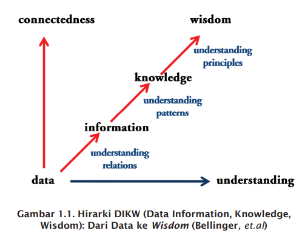

- https://scholar.google.co.id/citations?user=JVGy8mQAAAAJ&hl=en
- https://onknowledge.wordpress.com/about/
- [[Manajemen Knowledge Sharing Berbasis Komunitas]] 2011
	- Hirarki Data, Information, Knowledge, Wisdom; dari Data ke Wisdom ([[Bellinger]], et.al)
	  id:: 61fea7a2-1a63-46fc-9704-a9b1b5be51e8
		- 
		- [[Bellinger]] [DIKW](https://www.systems-thinking.org/dikw/dikw.htm):
			- According to Russell Ackoff, a systems theorist and professor of organizational change, the content of the human mind can be classified into five categories:
				- Data: symbols
				- Information: data that are processed to be useful; provides answers to "who", "what", "where", and "when" questions
				- Knowledge: application of data and information; answers "how" questions
				- Understanding: appreciation of "why"
				- Wisdom: evaluated understanding.
			- Ackoff indicates that the first four categories relate to the past; they deal with what has been or what is known. Only the fifth category, wisdom, deals with the future because it incorporates vision and design. With wisdom, people can create the future rather than just grasp the present and past. But achieving wisdom isn't easy; people must move successively through the other categories.
			- A further elaboration of Ackoff's definitions follows:
				- **Data**... data is raw. It simply exists and has no significance beyond its existence (in and of itself). It can exist in any form, usable or not. It does not have meaning of itself. ^^In computer parlance, a spreadsheet generally starts out by holding data.^^
				- **Information**... information is data that has been given meaning by way of relational connection. This "meaning" can be useful, but does not have to be. ^^In computer parlance, a relational database makes information from the data stored within it.^^
				- **Knowledge**... knowledge is the appropriate collection of information, such that it's intent is to be useful. Knowledge is a deterministic process. When someone "memorizes" information (as less-aspiring test-bound students often do), then they have amassed knowledge. This knowledge has useful meaning to them, but it does not provide for, in and of itself, an integration such as would infer further knowledge. For example, elementary school children memorize, or amass knowledge of, the "times table". They can tell you that "2 x 2 = 4" because they have amassed that knowledge (it being included in the times table). But when asked what is "1267 x 300", they can not respond correctly because that entry is not in their times table. To correctly answer such a question requires a true cognitive and analytical ability that is only encompassed in the next level... understanding. ^^In computer parlance, most of the applications we use (modeling, simulation, etc.) exercise some type of stored knowledge.^^
				- **Understanding**... understanding is an interpolative and probabilistic process. It is cognitive and analytical. It is the process by which I can take knowledge and synthesize new knowledge from the previously held knowledge. The difference between understanding and knowledge is the difference between "learning" and "memorizing". People who have understanding can undertake useful actions because they can synthesize new knowledge, or in some cases, at least new information, from what is previously known (and understood). That is,^^understanding can build upon currently held information, knowledge and understanding itself^^ . In computer parlance, AI systems possess understanding in the sense that they are able to synthesize new knowledge from previously stored information and knowledge.
				- **Wisdom**... wisdom is an extrapolative and non-deterministic, non-probabilistic process. It calls upon all the previous levels of consciousness, and specifically upon special types of human programming (moral, ethical codes, etc.). It beckons to give us understanding about which there has previously been no understanding, and in doing so, goes far beyond understanding itself. It is the essence of philosophical probing. Unlike the previous four levels, it asks questions to which there is no (easily-achievable) answer, and in some cases, to which there can be no humanly-known answer period. Wisdom is therefore, the process by which we also discern, or judge, between right and wrong, good and bad. I personally believe that computers do not have, and will never have the ability to posses wisdom. Wisdom is a uniquely human state, or as I see it, wisdom requires one to have a soul, for it resides as much in the heart as in the mind. And a soul is something machines will never possess (or perhaps I should reword that to say, a soul is something that, in general, will never possess a machine).
			- Data represents a fact or statement of event without relation to other things.
				- Ex: It is raining.
			- Information embodies the understanding of a relationship of some sort, possibly cause and effect.
				- Ex: The temperature dropped 15 degrees and then it started raining.
			- Knowledge represents a pattern that connects and generally provides a high level of predictability as to what is described or what will happen next.
				- Ex: If the humidity is very high and the temperature drops substantially the atmospheres is often unlikely to be able to hold the moisture so it rains.
			- Wisdom embodies more of an understanding of fundamental principles embodied within the knowledge that are essentially the basis for the knowledge being what it is. Wisdom is essentially systemic.
				- Ex: It rains because it rains. And this encompasses an understanding of all the interactions that happen between raining, evaporation, air currents, temperature gradients, changes, and raining.
		-
		-
	-
-